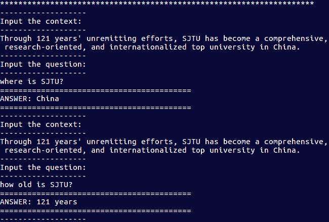

# Reading Comprehension on SQuAD

### Note:

* Almost re-implement the paper: [Machine Comprehension Using Match-LSTM and Answer Pointer](https://arxiv.org/abs/1608.07905)

* It's a simple baseline for the task, I get only `f1: 0.643` and `em: 0.4975` on the dev.
* Since I only have access to an NV1060 card, so I did only several training and evaluation on dev set.
* I changed a little bit of the structure of the files.

## Train
Please check the cs224n assignment 4 for installing dependencies etc.

Set the parameters in `Config.py`.
then run:
```shell
python train.py
```

## Test

**Note the `"--"` before the keyword.**

If trained multiple models, one can run:
```shell
python eval_ensemble.py
```
to do ensemble test.

Meanwhile, one can run:
```shell
python eval_interactive.py --ckpt='path/to/ckpt' --vocab='path/to/vocab.bat' --embed='path/to/embedding'
```
to do interactive test, where you can input context and question, then take a look what the model get for you.
<div align='center'>

</div>


## Takeaways 

* random shuffle the training set is important.
* initialization the weights of rnns is crucial, and i tried to use identity initialization but 
did not do experiment to see how it differed from xavier or others.
* regularization is deadly needed.
* My best result is: `F1: 0.643` and `EM: 0.4975` for 4000 samples in dev set.

<div align='center'>

</div>

## TO DO:

- [x] Plot histgrams of context, question, answer lengthes.
- [x] preprocess the inputs with mask.
- [x] make decision how to represent the answer.
- [x] figure out the overall architecture.
- [x] add tensorboard to monitor.
- [x] overfit a minibatch.
- [x] done tones of things, and miss keeping note.
- [x] use running average algorithm to draw a nicer loss curve.
- [x] add interactive mode.
- [ ] finish qa_answer.py, work with pure json file.


## Programming Assignment 4 (by stanford cs224n)
Welcome to CS224N Project Assignment 4 Reading Comprehension.
The project has several dependencies that have to be satisfied before running the code. You can install them using your preferred method -- we list here the names of the packages using `pip`.

## Requirements

The starter code provided pressuposes a working installation of Python 2.7, as well as a TensorFlow 0.12.1.

It should also install all needed dependnecies through
`pip install -r requirements.txt`.

## Running your assignment

**Be aware that the file structure is a little bit different for this repo.**

You can get started by downloading the datasets and doing dome basic preprocessing:

$ code/get_started.sh

Note that you will always want to run your code from this assignment directory, not the code directory, like so:

$ python code/train.py

This ensures that any files created in the process don't pollute the code directoy.
